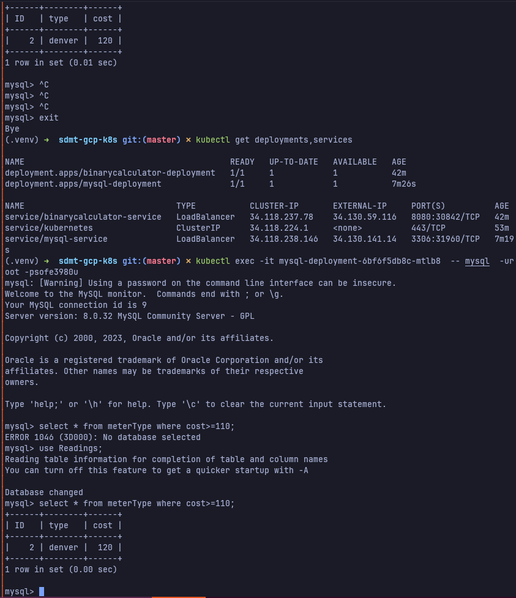
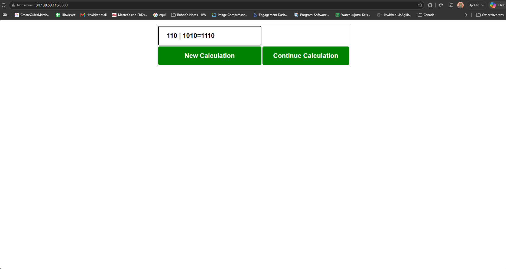
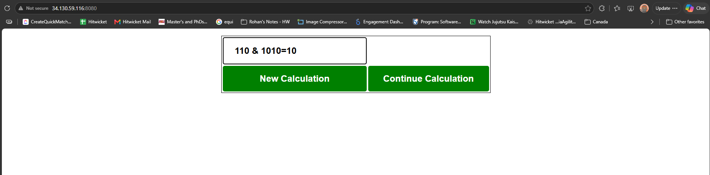
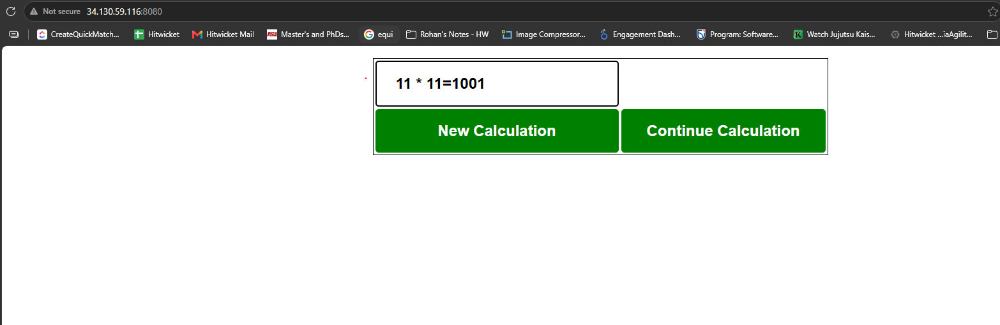
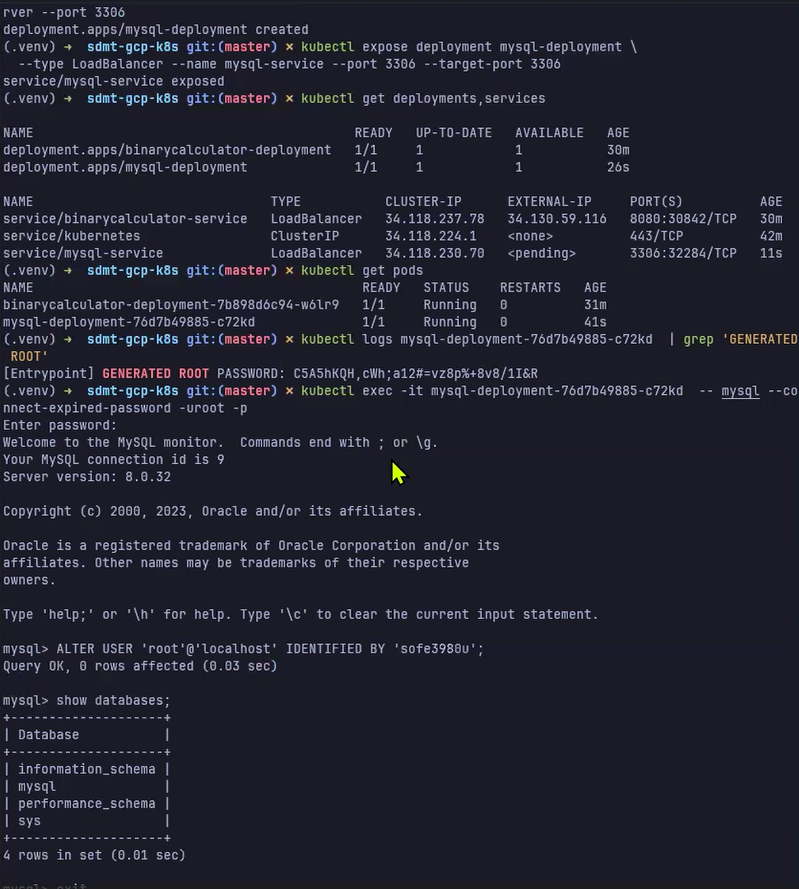
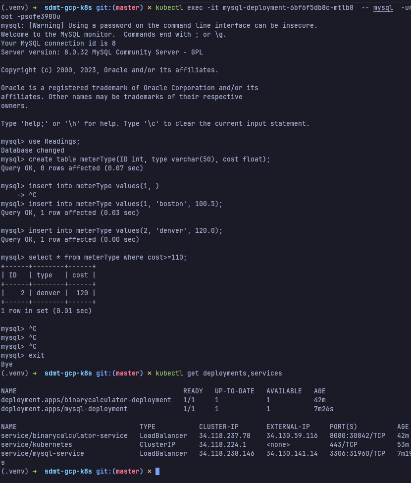

# Lab 3 Part 1: Docker and Kubernetes on GKE

**Course:** ENGR 5520G, Software Development Methods and Tools

**Student:** Rohan Muslekar

**Student ID:** 101006689

**GCP project:** `project-177cbd41-037f-441e-80d`

## Deliverable links

| Item | Link |
| --- | --- |
| Full repository (web application and YAML files) | [github.com/Rohan-Muslekar/sdmt-gcp-k8s](https://github.com/Rohan-Muslekar/sdmt-gcp-k8s) |
| Web application | [webapp/](https://github.com/Rohan-Muslekar/sdmt-gcp-k8s/tree/master/webapp) |
| YAML files | [k8s/](https://github.com/Rohan-Muslekar/sdmt-gcp-k8s/tree/master/k8s) and [mysql/](https://github.com/Rohan-Muslekar/sdmt-gcp-k8s/tree/master/mysql) |
| Video 1, deploy the app with YAML and instructions (rubric 7 and 12) | [Open in Google Drive](https://drive.google.com/file/d/1twpn-naKbfilwFWeG6_q48iVYJ799hTG/view?usp=sharing) |
| Video 2, MySQL with kubectl commands and with YAML (rubric 10 and 11) | [Open in Google Drive](https://drive.google.com/file/d/1aP38Gl9-oIMNCaMeEiD3maR_yw_XIViw/view?usp=sharing) |

---

## 1. Docker

### 1.1 What is Docker

Docker is a platform for building and running applications inside **containers**. A container packages an application together with everything it needs to run, its code, runtime, system libraries, and settings, into one unit that runs the same way on any machine that has Docker installed. Instead of installing the application and its dependencies directly on a host, Docker runs the packaged container in an isolated environment, so the application behaves identically on a laptop, a build server, or a cloud node. Containers share the host operating system kernel rather than each carrying a full guest operating system, which makes them far lighter and faster to start than virtual machines.

### 1.2 Terminologies: image, container, and registry

**Image.** An image is a read-only template that contains the application and its dependencies in layers. It is built from a `Dockerfile`, which lists the steps to assemble the image: a base image to start from, files to copy in, and the command to run. The Dockerfile for the web application in this lab starts from a Java base image, copies the built WAR file from the `target` folder, and sets the command that launches the application. An image is immutable: building it again produces the same template.

**Container.** A container is a running instance of an image. The image is the template and the container is the live process created from it, with its own isolated filesystem, network, and process space. Many containers can be started from the same image, and each runs independently. When a container stops it can be removed without affecting the image it came from.

**Registry.** A registry is a server that stores and distributes images so they can be shared and pulled from anywhere. Docker Hub is the public registry; this lab uses **Google Artifact Registry**, a private registry in the project. After the image is built it is pushed to the registry with `docker push`, and Kubernetes later pulls it from there when it creates the pods. The image name encodes its registry location, for example `northamerica-northeast2-docker.pkg.dev/<project>/sofe3980u/binarycalculator`.

### 1.3 Advantages and disadvantages

**Advantages:**

- **Consistency across environments.** Because the container carries its own dependencies, "it works on my machine" problems disappear: the same image runs identically in development, testing, and production.
- **Lightweight and fast.** Containers share the host kernel and start in seconds, so they use far fewer resources than full virtual machines and allow many more instances on the same hardware.
- **Portability and easy scaling.** An image built once can run on any Docker host or be scaled to many identical containers behind a load balancer without reconfiguration.

**Disadvantage:**

- **Weaker isolation and added operational complexity.** Containers share the host kernel, so the isolation boundary is thinner than a virtual machine's, which raises security considerations. Running many containers in production also needs an orchestration layer (Kubernetes) and image, registry, and networking management, which adds a learning curve and moving parts.

---

## 2. Kubernetes

### 2.1 What is Kubernetes

Kubernetes is an open-source system for **orchestrating containers**: it automates deploying, scaling, and managing containerized applications across a group of machines. Docker runs a container on one host; Kubernetes runs containers across many hosts and keeps them in the state you asked for. You describe the desired state (for example, "run one replica of this image and expose it on port 8080"), and Kubernetes continuously works to match reality to that description. It schedules containers onto machines, restarts them when they crash, replaces them when a machine fails, scales them up or down, and routes traffic to them. Google Kubernetes Engine (GKE) is a managed Kubernetes offered by Google Cloud, which is where this lab deploys.

### 2.2 Terminologies: cluster, pod, deployment, and service

**Cluster.** A cluster is the whole set of machines that Kubernetes manages, together with the control plane that runs it. The control plane makes the scheduling and management decisions, and the worker **nodes** are the machines that actually run the containers. In this lab the GKE cluster is created with `gcloud container clusters create` and provides the nodes that host the application.

**Pod.** A pod is the smallest unit Kubernetes deploys. It wraps one or more closely related containers that share the same network address and storage. Most pods, including the ones in this lab, hold a single container. Pods are disposable: Kubernetes creates and destroys them as needed, and each gets its own internal IP.

**Deployment.** A deployment is a controller that manages a set of identical pods and keeps the requested number of them running. You tell the deployment which image to run and how many **replicas** to maintain, and it creates the pods, recreates any that fail, and performs rolling updates when the image changes. The web application here is managed by a deployment named `binarycalculator-deployment`.

**Service.** A service gives a stable network endpoint for a changing set of pods. Because pods come and go and their IPs change, a service provides one fixed address and load-balances traffic across the matching pods, which it selects by label. A service of type **LoadBalancer**, as used here, asks GKE to provision an external IP so the application can be reached from the internet. The web application is exposed by `binarycalculator-service` on port 8080.

---

## 3. The YAML files

Kubernetes objects are described in YAML manifests and created with `kubectl apply -f`. The manifests for the web application are in `k8s/`.

### 3.1 Overall format

Every manifest has the same four top-level fields:

- **`apiVersion`**: the API group and version of the object (`apps/v1` for a Deployment, `v1` for a Service).
- **`kind`**: the type of object (`Deployment`, `Service`).
- **`metadata`**: the object's name and labels.
- **`spec`**: the desired state, whose contents depend on the kind.

The deployment manifest, `k8s/deployment.yaml`:

```yaml
apiVersion: apps/v1
kind: Deployment
metadata:
  name: binarycalculator-deployment
  labels:
    app: binarycalculator
spec:
  replicas: 1
  selector:
    matchLabels:
      app: binarycalculator
  template:
    metadata:
      labels:
        app: binarycalculator
    spec:
      containers:
        - name: binarycalculator
          image: IMAGE_PATH
          ports:
            - containerPort: 8080
```

The service manifest, `k8s/service.yaml`:

```yaml
apiVersion: v1
kind: Service
metadata:
  name: binarycalculator-service
  labels:
    app: binarycalculator
spec:
  type: LoadBalancer
  selector:
    app: binarycalculator
  ports:
    - protocol: TCP
      port: 8080
      targetPort: 8080
```

### 3.2 Image name

In the deployment, `spec.template.spec.containers[0].image` names the image Kubernetes pulls and runs. The placeholder `IMAGE_PATH` is replaced at deploy time with the Artifact Registry path of the pushed image, `northamerica-northeast2-docker.pkg.dev/project-177cbd41-037f-441e-80d/sofe3980u/binarycalculator`.

### 3.3 Port number

The deployment declares `containerPort: 8080`, the port the Spring Boot application listens on inside the pod. The service forwards `port: 8080` (the port exposed on the external IP) to `targetPort: 8080` (the container port), so browser traffic to the external IP on 8080 reaches the application.

### 3.4 Service type

The service sets `type: LoadBalancer`. This asks GKE to provision an external load balancer and a public IP for the service, which is how the application becomes reachable from outside the cluster. The alternative types are `ClusterIP` (internal only) and `NodePort` (a port on each node); LoadBalancer is used here because the application must be reached by IP from a browser.

---

## 4. Web application and repository

The repository contains the web application and the YAML files (rubric 8).

- `webapp/` holds the **Binary Calculator** Spring Boot application and its `Dockerfile`. The application serves an HTML calculator on port 8080 and operates on unsigned binary numbers. The `Binary` class implements `add` (`+`), `multiply` (`*`), `or` (`|`), and `and` (`&`), and `BinaryController` maps the chosen operator to the matching operation.
- `k8s/` holds `deployment.yaml` and `service.yaml` for the web application.
- `mysql/` holds `mysql-deploy.yaml` and `mysql-service.yaml` for the MySQL server.

The image is built and pushed with:

```bash
cd webapp
mvn package
docker build -t northamerica-northeast2-docker.pkg.dev/$PROJECT/sofe3980u/binarycalculator .
docker push northamerica-northeast2-docker.pkg.dev/$PROJECT/sofe3980u/binarycalculator
```

---

## 5. Deploying and accessing the application by IP

The deployment and service are created from the YAML files:

```bash
sed "s#IMAGE_PATH#$IMAGE#" k8s/deployment.yaml | kubectl apply -f -
kubectl apply -f k8s/service.yaml
kubectl get deployments,services
```

Once `binarycalculator-service` shows an `EXTERNAL-IP`, the application is reached at `http://<EXTERNAL-IP>:8080`.




### 5.1 OR examples

| operand1 | operand2 | result (OR) |
| --- | --- | --- |
| 110 | 1010 | 1110 |
| 1 | 100 | 101 |



### 5.2 AND examples

| operand1 | operand2 | result (AND) |
| --- | --- | --- |
| 110 | 1010 | 10 |
| 111 | 101 | 101 |



### 5.3 Multiplication examples

| operand1 | operand2 | result (multiply) |
| --- | --- | --- |
| 11 | 11 | 1001 |
| 111 | 101 | 100011 |



---

## 6. MySQL

MySQL is deployed two ways. Both use the `mysql/mysql-server` image on port 3306, with user `user`, password `sofe3980u`, and schema `Readings`.

### 6.1 Using kubectl commands (rubric 10)

```bash
kubectl create deployment mysql-deployment --image mysql/mysql-server --port 3306
kubectl expose deployment mysql-deployment --type LoadBalancer --name mysql-service --port 3306 --target-port 3306
kubectl get deployments,services
```

Access the database by opening a client inside the pod:

```bash
kubectl exec -it <mysql-pod> -- mysql -uroot -psofe3980u
```

Once the service has an external IP it can also be reached from any machine with `mysql -uuser -psofe3980u -h<EXTERNAL-IP>`.



### 6.2 Using YAML files (rubric 11)

```bash
kubectl apply -f mysql/mysql-deploy.yaml
kubectl apply -f mysql/mysql-service.yaml
kubectl get deployments,services
```

`mysql/mysql-deploy.yaml` sets the image, the credentials, and the `Readings` database through environment variables and exposes `containerPort: 3306`; `mysql/mysql-service.yaml` is a LoadBalancer on 3306. After connecting, the example SQL runs:

```sql
use Readings;
create table meterType(ID int, type varchar(50), cost float);
insert into meterType values(1,'boston',100.5);
insert into meterType values(2,'denver',120.0);
select * from meterType where cost>=110;
```



---

## 7. Videos

| Video | Shows | Link |
| --- | --- | --- |
| 1 | Creating the deployment and service with the YAML files, with instructions (rubric 7 and 12) | [Open in Google Drive](https://drive.google.com/file/d/1twpn-naKbfilwFWeG6_q48iVYJ799hTG/view?usp=sharing) |
| 2 | MySQL with kubectl commands and with YAML, and accessing MySQL (rubric 10 and 11) | [Open in Google Drive](https://drive.google.com/file/d/1aP38Gl9-oIMNCaMeEiD3maR_yw_XIViw/view?usp=sharing) |

---

## Appendix: commands used

Scoped to the `sdt-ms3` gcloud config. Full runbook in `scripts/setup-k8s.sh`.

```bash
export CLOUDSDK_ACTIVE_CONFIG_NAME=sdt-ms3
PROJECT=$(gcloud config get-value project)
REGION=northamerica-northeast2
IMAGE=$REGION-docker.pkg.dev/$PROJECT/sofe3980u/binarycalculator

# registry and image
gcloud artifacts repositories create sofe3980u --repository-format docker --location $REGION
gcloud auth configure-docker $REGION-docker.pkg.dev --quiet
cd webapp && mvn package && docker build -t $IMAGE . && docker push $IMAGE && cd ..

# cluster
gcloud container clusters create k8s-lab --zone northamerica-northeast2-a --num-nodes 2 --machine-type e2-small
gcloud container clusters get-credentials k8s-lab --zone northamerica-northeast2-a

# web app via YAML
sed "s#IMAGE_PATH#$IMAGE#" k8s/deployment.yaml | kubectl apply -f -
kubectl apply -f k8s/service.yaml
kubectl get services   # read the EXTERNAL-IP, open http://<IP>:8080

# MySQL via kubectl commands
kubectl create deployment mysql-deployment --image mysql/mysql-server --port 3306
kubectl expose deployment mysql-deployment --type LoadBalancer --name mysql-service --port 3306 --target-port 3306

# MySQL via YAML
kubectl apply -f mysql/mysql-deploy.yaml
kubectl apply -f mysql/mysql-service.yaml

# access MySQL
kubectl exec -it <mysql-pod> -- mysql -uroot -psofe3980u

# teardown
gcloud container clusters delete k8s-lab --zone northamerica-northeast2-a
```
